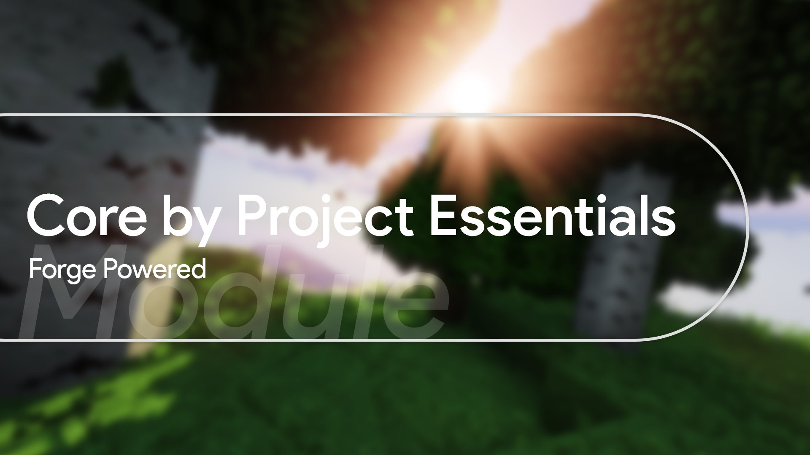

## Project Essentials Core: core mod for all modules of Project Essentials.

### What is it

This is the base module (core) for all other Project Essentials modules. It contains the necessary dependencies that are used in other modules, for example Kotlin std lib and Kotlinx Serialization and Brigadier, this core also contains common code, for example, the initialization process and some extensions of existing forge classes, which can be useful and can reduce duplicate code. For developers, all the information is in the [documentation](https://mairwunnx.gitbook.io/project-essentials/project-essentials-core#using-as-api).

### Last steps

#### [Download mod](https://github.com/ProjectEssentials/ProjectEssentials-Core/releases/download/v1.14.4-1.2.0/ProjectEssentials-Core-MOD-1.14.4-1.2.0.jar) · [Download API](https://github.com/ProjectEssentials/ProjectEssentials-Core/releases/download/v1.14.4-1.2.0/ProjectEssentials-Core-API-1.14.4-1.2.0.jar) · [How to install](https://mairwunnx.gitbook.io/project-essentials/project-essentials-core#how-to-install) · [Configuration](https://mairwunnx.gitbook.io/project-essentials/project-essentials-core#configuration) · [API Using](https://mairwunnx.gitbook.io/project-essentials/project-essentials-core#using-as-api) · [Troubleshooting](https://github.com/ProjectEssentials/ProjectEssentials-Core/issues/new/choose) · [News & updates](https://t.me/minecraftforge)

### Compatibility

Currently mod branch supported forge version `28.0.X` and `28.1.X` (Minecraft `1.14.4`).

### Credits

- Author: Pavel Erokhin [@mairwunnx](https://github.com/mairwunnx)
- [JetBrains](https://www.jetbrains.com/) for product licenses
- Inspired by: [EssentialsX](https://github.com/EssentialsX)
